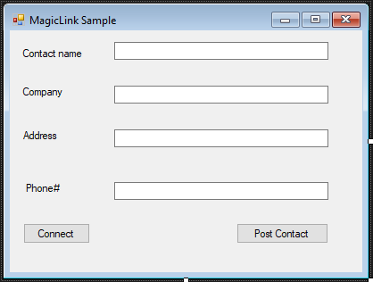
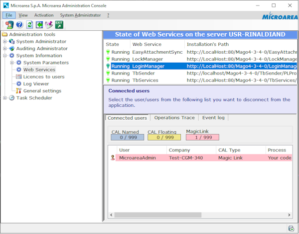
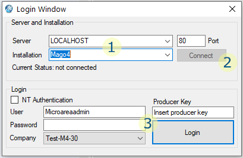
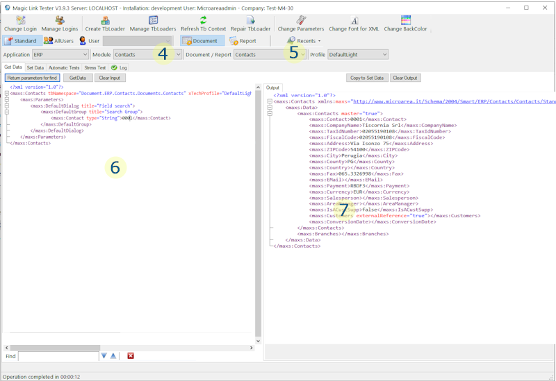
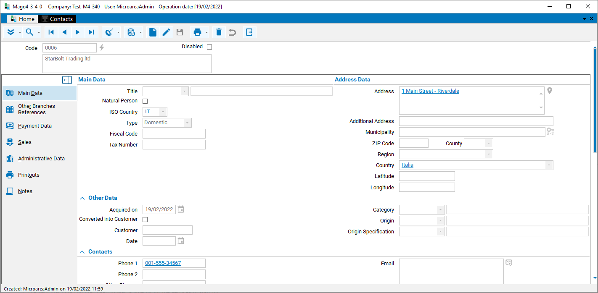

# Your First MagcLink application

In this walkthrough, we will see how to create a very simple, yet working, application which make use of MagicLink to post data into Mago4.  
This application is not able to perform any meaningful task, but its purpose is just demonstrating the basic principles of interfacing an application with Mago4 via MagicLink. 

This example is presented in C# language under the Visual Studio 2019 environment.  
This sample assumes you are interfacing with a Mago4 3.1 version, but it will works well also with other versions.

This repository contains a sample about [posting a new Contact via MagicLink, and below there is a step-by-step guide to create it.

## Prerequisites

In order to create this sample application we will need:
* Visual Studio 2019 (or above)
* a working Mago4 with a sample company data set

To learn how to download and install Mago4, see: [Installing and configuring Mago4](http://www.microarea.it/MicroareaHelpCenter/RefGuide-M4-ERP-InstallationGuide.ashx).  
If you are working on a licensed copy of Mago4, you have to check for some prerequisites, see: [Deploying MagicLink-based Applications](http://www.microarea.it/MicroareaHelpCenter/RefGuide-Extensions-TBMagicPlatform-DeployingMagicLinkApplications.ashx).  
_Note: all the above links require authentication_.

## Step 1: Creating the sample application
We will initially create a very thin sample application, and then we will integrate it to Mago4.  
The task of this application will be to gather few data about a Contact and post a new contact inside Mago4.  
Despite of its simplicity, this will let us possible to learn the basics of communicating with Mago4 via the web services exposed through the MagicLink layer.

Open Visual Studio 2019 and create a new Windows Form C# project; name it as you prefer (i.e.: "MagicLinkSample"). 

Add the following controls to the form:
* a textbox for the Contact Name
* a textbox for the Company Name
* a textbox for the Address
* a textbox for the Phone number
* a button to Connect to Mago4
* a button to Post the contact to Mago4

Your form should look like this:



## Step 2: Connecting to Mago4 through LoginManager
To do any action through the MagicLink web services, we need to be authenticated by the Mago4 security system. To authenticate, we must provide a valid user name and password to the authentication web service, that is called LoginManager.  
We will receive from it an authentication token that we will need to provide to any subsequent call to the MagicLink web services.

The first thing to do, in order to make a call to the LoginManager web service, is to add a reference to it. From the Solution Explorer of VS2019, right-click on the "References" node and select "Add Service Reference".

Type the following address: `http://localhost/Mago4/LoginManager/LoginManager.asmx`, and press "Go". Please note that you may need to replace `localhost` with the name of the server on which Mago4 is installed, if different from the local PC, and `Mago4` with the instance name of your Mago4, if you changed it during installation (i.e.: "MyMago4").


Give a meaningful name to the reference, i.e.: "MagoLoginManager", and press "OK".

Visual Studio places your reference under a "Connected Services" node. It has also created a wrapper class around it that will help you in dealing with the web service call, so that for you it will be not different from using a normal C# class.

As stated before, we will use the LoginManager web service to authenticate and get a token to be used in subsequent calls for doing the real action (that is, posting a contact). The authentication token is a string, we will store it in a class variable so that we will have it handy until the program ends.

We will implement the call to LoginManager inside the handler of the "Connect" button, double-click on it to have Visual Studio creating automatically the handler.  
Insert the following code lines:

```C#
using (MagoLoginManager.MicroareaLoginManagerSoapClient aLogMng = new MagoLoginManager.MicroareaLoginManagerSoapClient())
{
    aLogMng.Endpoint.Address = new System.ServiceModel.EndpointAddress(string.Format("http://{0}/{1}/LoginManager/LoginManager.asmx", server, instance));

    try
    {
        int aRes = aLogMng.LoginCompact(ref loginName, ref companyName, password, "Your code here", true, out authenticationToken);

        if (aRes != 0) // 0 means no errors
            MessageBox.Show(string.Format("Error occurred, code: {0}", aRes));
        else
            MessageBox.Show("Connected!");
    }
    catch (Exception logExc)
    {
        MessageBox.Show(string.Format("Exception occurred: {0}", logExc.Message));
    }
}
```

We need to define and set the following variables in your code:

```C#
string server = ""; // the server where Mago is installed: "localhost" or some PC in the LAN
string instance = "Mago4"; // Mago4 is the default instance name, but it can be changed
string loginName = ""; // a valid user name
string password = ""; // its password
string companyName = ""; // name of the company, owner of the DB
```

We can hard-code these values in the source code, or collect them from the UI.

Please note that you have also to declare `authenticationToken` as string variable of your form class.  
The `askingProcess` parameter (here shown as "Your code here" placeholder) has to be replaced with the Producer Key assigned to you. The Producer Key univokely identify your company as the producer of your solution among all the Microarea partner. It is mainly used for license authentication. To learn more, please see: [What is the Producer Key?](http://www.microarea.it/MicroareaHelpCenter/Misc-Extensions-TBMagicPlatform-WhatIsTheProducerKey.ashx).

While writing down the code, you will see that Visual Studio's Intellisense is proposing you the class and members names. This is because a wrapper class was created to encapsulate the web service, so that you can take full advantage of the VS IDE.

_Note: the `using()` construct shown here is those suggested by Microsoft's documentation when using service wrapper classes: it provides automatic cleanup of the wrapper class at the method's end. Remember that service accesses (SOAP calls in this case) may be limited resources, so that it is better to use them carefully._

As you can see, the login method call (`LoginCompact`) returns a code if not succesfull. The error code explains the reasons of the failure. To see a complete list of error codes, please see: [MagicLink Error Codes](http://www.microarea.it/MicroareaHelpCenter/RefGuide-Extensions-TBMagicPlatform-MagicLinkErrorCodes.ashx).  
The Web Service call may also cause a number of exceptions, which are catched by the `try .. catch` block. Such exceptions may occur due to communication infrastructure problems, please refer to Microsoft documentation for details about them.

To complete our implementation, we also need to ensure the program will log off from LoginManager system, to avoid the CAL be set as in use by a process that is no more active. Remember that total number of available CAL is normally limited in a Mago4 installation, so that we cannot waste them.  
For doing this, we will add an event hanlder to the "FormClosing" event of the form (from the design view, in the "Properties" pane, switch to the event list and double click on the FormClosing event, this automatically declare and creates an event handler). In its body, write the following code lines:

```C#
if (authenticationToken != string.Empty)
{
    using (MagoLoginManager.MicroareaLoginManagerSoapClient aLog = new MagoLoginManager.MicroareaLoginManagerSoapClient())
    {
        aLog.Endpoint.Address = new System.ServiceModel.EndpointAddress(string.Format("http://{0}/{1}/LoginManager/LoginManager.asmx", server, instance));
        aLog.LogOff(authenticationToken);
    }
}
```

We can now compile and run our application. By clicking on the "Connect" button, we should see the success message. The very first call may require some time due to the initial service startup.

The authentication token has no timeout, so it will not expire until we explicitly log off (in this case, by closing the application).  
To check for the currently logged users, open the Microarea Administration Console without closing the sample application.



From the tree menu, select _System Information_, _Web Services_, then click on the _LoginManager_ Web Service. On the bottom pane the currently logged user status is displayed.  
As you can see, the login made through the sample application is shown.  
If you close the application and come back to the Console, right-click anywhere on the users list, _Refresh_, you will see that the CAL was cleared by the logout action.

In case an user remains logged in due to an application failure, this screen give you the possibility to remove it: right-click on it, and then select _Disconnect_.

## Step 3: Preparing the XML data to be posted
In order to post the contact's data to Mago4, we need to format the data into a proper XML format, by respecting the schema required by the MagicLink web services.  
The easiest way to do this is to get a sample of such XML stream and reproduce it inserting our contact's data.  
We will use the MagicLinkTester tool to get such XML sample.

Just start MagicLinkTester, and follow these instructions:



1. Set the server and the Mago4 instance we want to post to in the "Server and Installation" groupbox.  
2. Click on the "Connect" button to startup the instance.  
3. In the "Login" groupbox, set the User, Password, Company and Producer Key fields, then click on the "Login" button.  

Tha main MagicLinkTester interface will open.



4. Select "Contacts" from the Module dropdown.  
5. Finally, select "Contacts" from the Document/Report dropdown and "DefaultLight" from the Profile dropdown.

We are now ready to query Mago4 via MagicLink web services to retrieve contacts data: such data will be formatted in the same way Mago4 is expecting to receive a post, so that we can retain the formatting and fill the structure with our data.

6. In the "Get Data" tab click on the "Return parameters for find" button: in the left pane an XML stream will be displayed, these are the parameter we may use to retrieve Contacts data.  
Remove all the lines which are embraced by the ``<maxs:DefaultGroup>`` tag, except those which starts with ``<maxs:Contact ...>``.  
In the middle part, write "%" as parameter. If you know a contact code stored in the database, you can use it (i.e.:"0001").

Click on the "GetData" button: the right pane will be filled with the XML data returned by the query. In the top part of the pane you can navigate through all the Contacts that was matching the query.

7. Pick the XML, and remove all the lines inside the ``<maxs:Contacts ...>`` tag, except for the following ones:
* ``maxs:CompanyName``
* ``maxs:Address``
* ``maxs:Telephone1``
* ``maxs:ContactPerson``

Remove also the empty node ``<maxs:Branches></maxs:Branches>``, it is not useful for our purposes.   
Finally, remove the text inside the tags, if any. Your XML fragment should look like this:

```XML
<?xml version="1.0"?>
<maxs:Contacts xmlns:maxs="http://www.microarea.it/Schema/2004/Smart/ERP/Contacts/Contacts/Standard/DefaultLight.xsd" tbNamespace="Document.ERP.Contacts.Documents.Contacts" xTechProfile="DefaultLight">
    <maxs:Data>
        <maxs:Contacts master="true">
            <maxs:CompanyName></maxs:CompanyName>
            <maxs:Address></maxs:Address>
            <maxs:Telephone1></maxs:Telephone1>
            <maxs:ContactPerson></maxs:ContactPerson>
        </maxs:Contacts>
    </maxs:Data>
</maxs:Contacts>
```
## Step 4: Posting data to Mago4
Now we are ready to post data to Mago4: we will use another web service, TBService, to do this, and use the formatted XML we get from MagicLinkTester to inject our form's data.

Go back to Visual Studio and right-click on the "Connected Services" node in the Solution Explorer pane, then "Add Service Reference".  
Type the following address: ``http://localhost/Mago4/TBServices/TBServices.asmx``, and press "Go".  
Give a meaningful name to the reference, i.e.: "MagoTBServices", and press "OK".

Now we will insert the code needed to post our data in the response to the click of the "Post contact" button: double-click it from the form designer to create the handler.
The code which do the post looks like this:

```C#
// 1
string xmlData = $@"<?xml version='1.0'?>
<maxs:Contacts xmlns:maxs='http://www.microarea.it/Schema/2004/Smart/ERP/Contacts/Contacts/Standard/DefaultLight.xsd' tbNamespace = 'Document.ERP.Contacts.Documents.Contacts' xTechProfile = 'DefaultLight' >
    <maxs:Data>
        <maxs:Contacts master='true'>
            <maxs:CompanyName>{txtCompanyName.Text}</maxs:CompanyName>
            <maxs:Address>{txtAddress.Text}</maxs:Address>
            <maxs:Telephone1>{txtPhone.Text}</maxs:Telephone1>
            <maxs:ContactPerson>{txtContactName.Text}</maxs:ContactPerson>
        </maxs:Contacts>
    </maxs:Data>
</maxs:Contacts> ";

// 2
using (MagoTBServices.TbServicesSoapClient aTbSvc = new MagoTBServices.TbServicesSoapClient())
{
    aTbSvc.Endpoint.Address = new System.ServiceModel.EndpointAddress(string.Format("http://localhost/{0}/TBServices/TBServices.asmx", instance));
    string aResult = string.Empty;

    // 3
    try
    {
        // 4
        if (aTbSvc.SetData(authenticationToken, xmlData, System.DateTime.Now, 0, false, out aResult))
            MessageBox.Show("Posted!");
        else
            MessageBox.Show("Not posted, some error occurred!");
    }
    catch (Exception tbExc)
    {
        MessageBox.Show(string.Format("Exception occurred: {0}", tbExc.Message));
    }
}

```

1. we create the XML data to post to Mago4 according the format returned by MagicLinkTester.  There are different ways to do this, the one shown is really raw, but sufficent for our actual needs.
1. we create an instance of the TBService web service hanlder, as previously done for LoginManager. The ``using`` construct provides the needed cleanup for the web service handler.
1. we embrace the calls to the web service wrapper in a ``try ... catch()`` block, to handle exceptions that may occur during web service invocation phase (i.e.: communication problems)
1. we invoke the ``SetData`` method of TBServices, providing:
    * the authentication token returned by login
    * the XML data
    * the date to be used as current date of operations.  The current date is important as it may affects defaults, settings and behaviors depending on the date of operation in many ERP business objects (not in this case)
    * the action to be done, "0" means "insert if not already present, otherwise update"
    * a parameter that is required only in case of handling of precision-dependent data (not in this case)
    * an ``out`` string in which Mago4 will return the data after processing, including errors or warning messages

Compile the application and run it.  
Click on the "Connect" button, then fill the form with some data.  
Click on the "Post Contact" button, if everything is working correctly, you should get the "Posted!" message.  
The very first time you may need to wait a little bit for the services to start up.

To check for what happened, just open Mago4, log in, then select ''Master Data, Contacts, Contacts'' from the menu. Double click to open the Contacts form.  
By clicking the ">|" toolbar button, you will browse to the last record, and you should see your data.



## Remarks - How it works
You may have noticed that you did not assign any primary key to your new contact, but the "Customer Contact" field was properly assigned with the next available contact number.  
Moreover, also the "Acquired on" and "Chart of Account a/c" fields have values assigned you did not post.

This is because the `SetData` method is not just inserting data into the Mago4 database table, but it make use of the Contacs business object (a.k.a. document).  
Such business object, invoked via the `SetData` call, is the same that is working in the background of the Contacts form, and it encapsulates the related business rules: assigning a number to a new contact, a default acquisition date, the default account, and so on.  
It behaves exactly as if you create a new contact by clicking on the "new" toolbar button in the Contacts form.

The Contacts business object is identified by its namespace, you can read it in the XML header of the data you posted: `Document.erp.contacts.documents.Contacts`.  
By means of this information, the TBServices web service is capable to retrieve the right business object handler, create an instance of it, and pass your data to it to be processed.

As a rule of thumb, any data you will include in your XML stream will be not overriden by any default. Any XML tag you omit will cause the business object to apply the default rule (if any) to fill the corresponding field.  
Please note that passing an empty XML tag (i.e.: `<maxs:Account></maxs:Account>`) will force the corresponding field to empty, which may be allowed or not. In the latter case, you will receive an error response.

These concepts apply to all the business objects contained in Mago4: Order, Invoices, Items, Manufacturing Plans, and so on.  
Each of them can be contacted via MagicLink by its namespace and can fully exploit all of its behaviors: assigning default, calculate totals, generate related documents, ...

This is how MagicLink let you make use of Mago4 business objects as an ERP back-end.  
To find out the structure and contents of the Mago4 business objects, see: [Business Objects Reference Guide](http://www.microarea.it/MicroareaHelpCenter/Document-Erp). The business objects are organized according the modules they belongs to.  
For example, here you can see the structure of the Contacts business object: [Contacts](http://www.microarea.it/MicroareaHelpCenter/Document-ERP-Contacts-Documents-Contacts.ashx).

## What's next
This walkthrough is just the starting point to explore the MagicLink capabilities.

To go on in understanding how MagicLink works, we suggest you to see the following walkthroughs:
* [How to set the Mago4 server and instance when connecting via MagicLink](http://www.microarea.it/MicroareaHelpCenter/Walkthrough-Extensions-TBMagicPlatform-HowToSetMagoNetServerAndInstance.ashx)
* [How to handle the responses returned by MagicLink web methods](http://www.microarea.it/MicroareaHelpCenter/Walkthrough-Extensions-TBMagicPlatform-HowToHandleResponseFromMagicLinkCalls.ashx)


